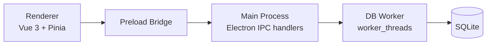

# Architecture

Second Brain is an Electron desktop app with a strict separation between renderer code and database execution.

## Runtime Topology

## Lifecycle

The boot path is centered in `electron/main.ts`.

1. Electron becomes ready.
2. `initDatabase()` resolves the live database path under `app.getPath("userData")`.
3. A startup backup may be created before the worker starts.
4. `startDbWorker()` initializes the worker and SQLite connection.
5. The main window is created.
6. IPC handlers for database, backup, archive, and file dialog flows are registered.

If database initialization fails, the app shows an error dialog and exits instead of leaving the renderer in a half-ready state.

## Process Boundaries

### Renderer

The renderer owns:

- Vue components and PrimeVue UI.
- Pinia state.
- Query orchestration for the active collection and active view.
- User feedback through the notifications store and toast queue.

The renderer never touches SQLite directly.

### Main Process

The main process owns:

- Electron app and BrowserWindow lifecycle.
- The preload bridge surface exposed as `window.electronAPI`.
- IPC validation and error shaping.
- File system operations such as dialogs, backup file copy, archive file read/write, and opening external URLs.
- Worker startup, shutdown, restart, and request timeout handling.

### Database Worker

The worker owns:

- SQLite connection setup.
- Table and index initialization.
- Query execution and transactional mutations.
- Full archive export and restore at the database level.

## IPC Safety

All renderer-to-main payloads must be structured-clone-safe.

- Pass plain objects, arrays, strings, numbers, booleans, and `null`.
- Do not pass Vue refs, proxies, or reactive store objects directly.
- Renderer errors should be handled through `handleIpc` instead of crashing the UI.

## Validation Boundary

Validation happens before worker execution.

- Renderer may use schemas for form behavior.
- Main process validates IPC inputs with Zod and `parseOrThrow`.
- Worker assumes validated input and focuses on database constraints and transactional correctness.

This keeps the worker focused on SQLite work and prevents malformed IPC payloads from reaching storage code.

## Search Model

Item search runs in SQL, not in renderer memory.

- If SQLite FTS5 is available, the app uses an `items_fts` virtual table plus triggers.
- If FTS cannot be enabled, the worker falls back to safe `LIKE` search.
- Sort and search remain paginated and validated either way.

## Resilience Rules

- Worker requests use timeouts in `worker-manager.ts`.
- Timed-out or crashed workers fail pending requests and can be restarted.
- The renderer should surface errors to the user and stay usable.
- Mutations are not automatically retried from the UI.
