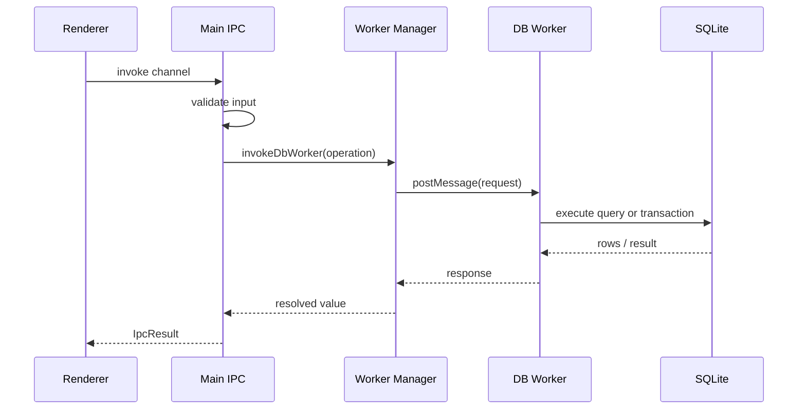

# Database & Worker

This page covers the SQLite schema, worker execution model, and transaction-heavy operations.

## Source-of-Truth Files

- Worker runtime: `electron/db/worker.ts`
- Worker protocol: `electron/db/worker-protocol.ts`
- Worker manager: `electron/db/worker-manager.ts`
- Schema init and FTS setup: `electron/db/init.ts`
- Collection queries: `electron/db/collections.ts`
- Field queries: `electron/db/fields.ts`
- View queries: `electron/db/views.ts`
- Item queries: `electron/db/items.ts`
- Search helpers: `electron/db/query-utils.ts`
- Full archive DB logic: `electron/lib/full-archive.ts`
- Backup file logic: `electron/lib/backup-utils.ts`

## Schema Ownership

`electron/db/init.ts` is responsible for creating and maintaining the core tables:

- `collections`
- `fields`
- `views`
- `items`
- `items_fts` virtual table when FTS is available

The `fields` table now includes a nullable `description` column. Schema upgrades use `PRAGMA user_version` migrations in `electron/db/init.ts`, and startup also repairs missing columns defensively for older databases that already have a stale version marker.

The same file also enables important SQLite pragmas:

- WAL mode
- foreign keys
- busy timeout

## Worker Protocol

`electron/db/worker-protocol.ts` defines the operation union for the database worker. It is the backend-side contract for all worker message types.

Operations include:

- CRUD for collections, views, fields, and items
- field type conversion preview and atomic conversion
- field-range aggregation for number presentation
- paginated item queries with search and sort
- reorder and bulk mutation operations
- collection import
- full archive summary, export, and restore

## Request Flow

## Query Model

Item queries are intentionally backend-driven.

- Renderer sends `collectionId`, `limit`, `offset`, optional search, and sort.
- Worker resolves field metadata and builds safe SQL.
- Total count and page data are returned together.
- Number color-scale UI uses a separate worker aggregate query to fetch min/max for one numeric field across the full collection.

This avoids loading the full collection into the renderer just to search or sort.

Sort entries use `{ field, order, emptyPlacement }`.

- `field` must target a collection data path such as `data.Title`.
- `order` is `1` for ascending and `-1` for descending.
- `emptyPlacement` is `first` or `last`; missing legacy values normalize to `last`.
- The Worker applies empty placement per sort entry before the field value sort, then falls back to item order and ID for stable pagination.

## FTS With Fallback

The worker attempts to enable SQLite FTS5 for item search.

- When available, the app maintains `items_fts` with triggers.
- If unavailable, search falls back to `LIKE` predicates.
- Both paths remain validated and paginated.

## Transaction-Heavy Operations

The worker is the only place that should execute multi-step persistent mutations.

Important transactional flows:

- `reorderFields`
- `convertFieldType`
- `reorderViews`
- `reorderItems`
- `bulkDeleteItems`
- `bulkPatchItems`
- collection import
- full archive restore

If any part of those operations is invalid, the whole mutation should fail and roll back.

Field type conversion runs entirely in the worker. Preview and apply share the
same conversion logic so the modal reflects the write path. Conversion preserves
missing values, treats null/empty values as empty, writes multiselect values as
the existing JSON-encoded string representation, and stores parsed dates as
`YYYY-MM-DD`. Conversions that cannot produce a valid target value write `null`.
The main process creates a `pre_restore` backup before invoking the conversion
worker operation.

## View Config Storage

Per-view presentation settings are stored in `views.config` as JSON.

That blob holds:

- column widths
- multi-sort state
- selected field IDs
- kanban grouping field, card title field, and column order
- calendar date field selection

`electron/db/views.ts` parses and validates that blob through `ViewConfigSchema`.

## Backup and Archive Responsibilities

Backups and archives split responsibility across layers.

### Backups

- Main process owns file copy, retention, restore, and app relaunch behavior.
- Worker must be stopped and restarted around backup-sensitive flows.

### Full Archives

- Main process owns archive file dialogs and disk read/write.
- Worker owns archive data export and restore against SQLite.

## Constraints

- The renderer must never loop over multiple IPC mutations for something that needs atomicity.
- JSON blob columns need a designated parse/serialize boundary.
- If a config or data blob is invalid, the backend should fail safely instead of propagating corrupt state.
